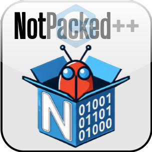

# Documentation

<h1 align="center">NotPacked++</h1>
<h3 align="center">Adversarial tool for breaking static detection of packed executable</h3>

Welcome to the NotPacked++ documentation. Here you can find information on how to use it and the features it provides.

NotPacked++, is an adversarial weaponized tool to alter a packed executable to evade static packing detection. It is designed to be used by malware analysts to test the effectiveness of their detection mechanisms and to improve their detection capabilities. It is also useful for red teamers to test the effectiveness of their evasion techniques, and highlight potential weaknesses of a target's security mechanisms.

In the current version, the tool focuses on the PE file format and the most common packers used in the wild. The tool is designed to be modular and extensible, so that it can be easily extended to support other file formats and packers.

## Table of Contents

- [Getting Started](#getting-started)
- [Installation](installation.md)
- [Alterations](alterations.md)
- [Usage](quick_start.md)

## Getting Started

To get started with NotPacked++, you can either download the latest release from the [releases page](https://github.com/packing-box/packer-masking-tool/releases) or build it from source.

- [Quick Start Guide](quick_start.md) : A quick guide to get you started with NotPacked++
- [Installation](installation.md) : Instructions on how to install dependencies and build NotPacked++

## Contributing
- [Contributing Guidelines](CONTRIBUTING.md) : Guidelines for contributing to NotPacked++